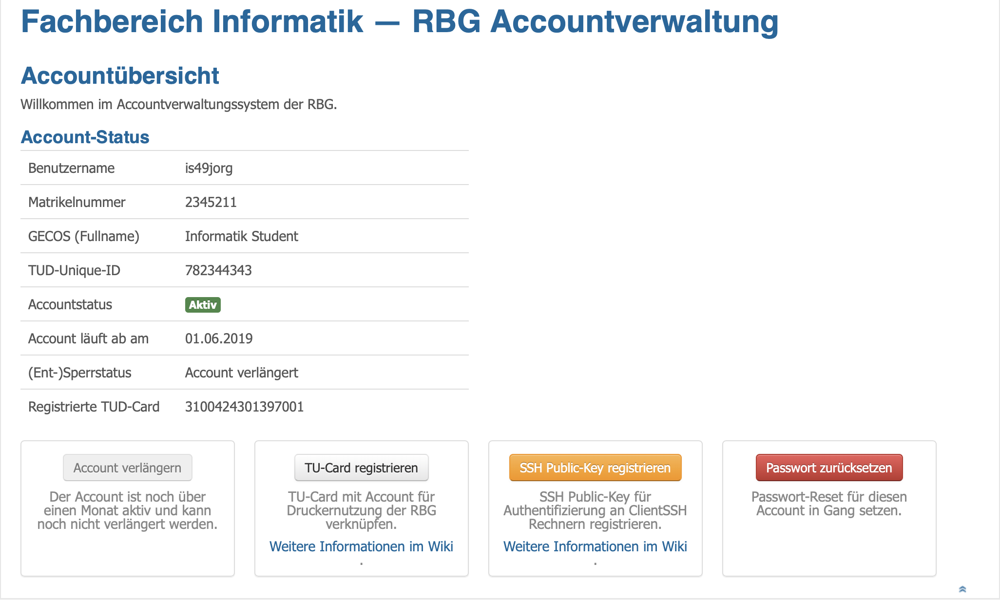
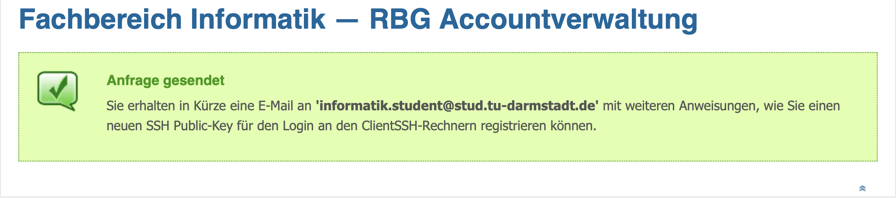
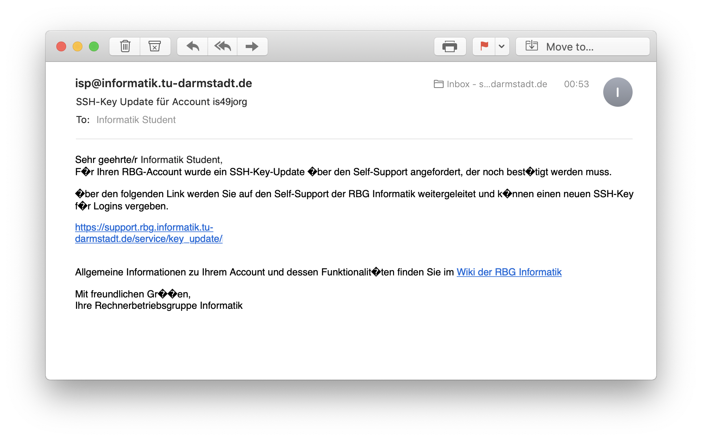

# RBG Zugang

Da Bluespec leider nur im RBG-Pool installiert ist, muss man, zum Experimentieren, den Compiler auf den Rechnern des RBG-Pools nutzen. Das kann man aber auch sehr leicht von Zuhause aus, wenn man Zugang zum Pool hat. Das ist zum Glück leicht zu realisieren.

## SSH-Key generieren

    $ ssh-keygen

## SSH-Key hochladen

Im [RBG Accountmanagement](https://support.rbg.informatik.tu-darmstadt.de) kann man sich mit seiner TU-ID anmelden, und kann dort einen Account beantragen oder einen SSH-Key hochladen.

Wenn man auf *SSH Public-Key registrieren* drückt, bekommt man eine Meldung, dass man in Kürze eine Mail mit weiteren Anweisungen bekommt.

Diese Mail enthält einen Link, auf den man gehen muss. Dort kann man dann seinen SSH-Key eingeben.

## Per SSH einloggen

Hat man alles richtig gemacht, kann man sich nun per SSH einloggen.

